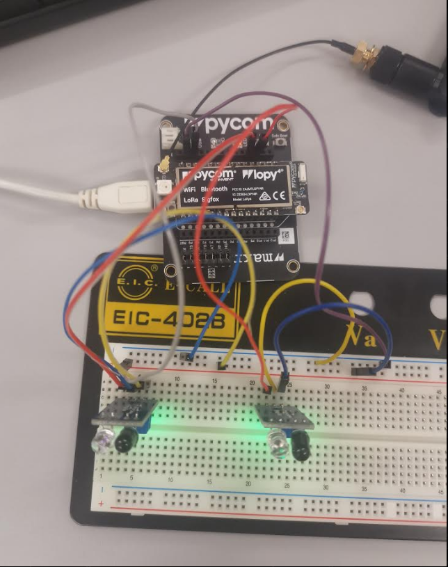

# Hårdvaruinstruktioner.

Programmet fungerar med två olika varianter av koppling, beroende på vad som efterfrågas. Dessa är en variant för in- och utpassering, den andra för enskilda parkeringsplatser.

Denna koppling använder sig utav följande komponenter:

IR-sensor:
https://cdon.se/bygg-verktyg/optisk-ir-hinder-kannare-digtal-utgang-passar-arduino-p49337300 (2x vid in- och utpassering, upp till 8 vid enskilda parkeringsplatser)

Kopplingssladdar (3x per sensor + 2 för distribution av 3V3 och GND)

LoPy4 Enhet: https://pycom.io/product/lopy4/

LoPy4 Expansion Board: https://pycom.io/product/expansion-board-3-0/

### Kopplingsschema för In- och utpassering
P16 -> OUT Sensor #1

P15 -> OUT Sensor #2

GND -> Blå linje på kopplingsbrädet -> GND på Sensor #1 och #2

3V3 -> Röd linje på kopplingsbrädet -> VCC på Sensor #1 och #2

Antenn -> 868 Mhz på LoPy enhet

### Kopplingsschema för enskild parkeringsplats
Pin -> OUT Sensor

GND -> Blå linje på kopplingsbrädet -> GND på Sensor

3V3 -> Röd linje på kopplingsbrädet -> VCC på Sensor

Antenn -> 868 Mhz på LoPy enhet

